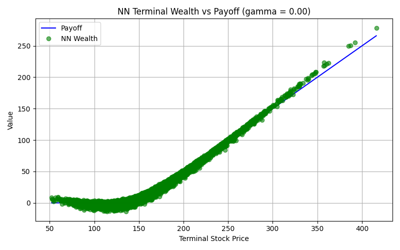
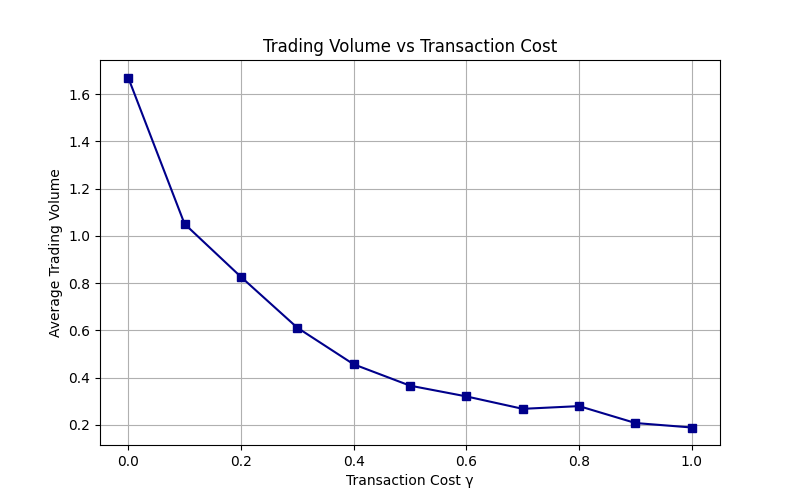
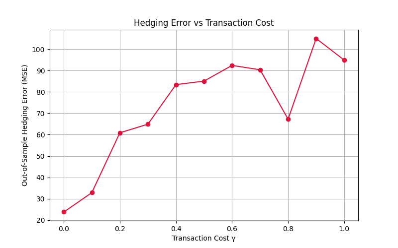
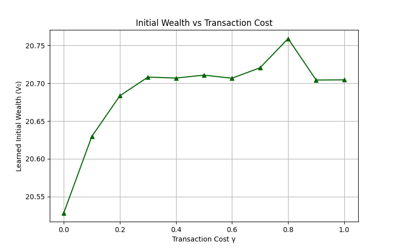
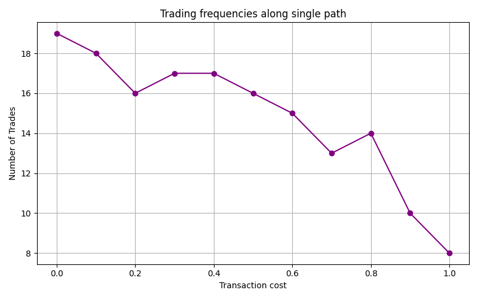
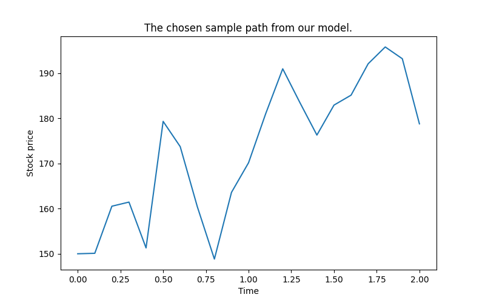
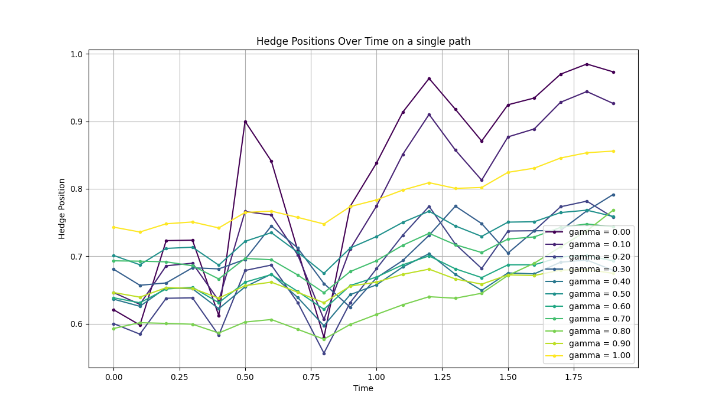

# Deep Hedging with Transaction Costs

This project implements a deep hedging strategy using delta hedging for a European call option in the Black-Scholes model with proportional transaction costs.  
The goal is to train a neural network-based trading strategy which:

1. learns the optimal initial capital for selling the option,
2. learns dynamic hedge positions over time, and
3. evaluates how the performance of the neural network changes for different levels of transaction costs $\gamma \in [0\%,100\%]$ .


## Objective of the Exercise

The objective is to hedge a European call option on a single stock by trading in discrete time while paying proportional transaction costs.  
Using deep hedging, we search for a trading strategy that maximises terminal wealth by minimising costs and hedging error for a given level of transaction costs, $\gamma$.
Different levels of transaction costs are considered, and the neural network architecture is analysed and evaluated along the aspects of:

1. Out-of-sample hedging error vs. transaction cost level
2. Learned initial wealth vs. transaction cost level
3. Trading volume vs. transaction cost level
4. Positions over time for different transaction cost levels (fixed stock price path)


## Trading-Cost Formula

The trading cost used in the project is

$$
C_T = \gamma \sum_{i=1}^{n} 
\left| \left(H_{t_i} - H_{t_{i-1}} \right) S_{t_{i-1}} \right|
\approx 
\gamma \int_0^T \left| S_t\, dH_t \right| ,
$$

where:

- $T$: option maturity
- $0 = t_0 < t_1 < \dots < t_n = T$: discrete trading times
- $T - t_i$: Time to maturity at time $t_i$.
- $S_{t_i}$: underlying stock price at time $t$
- $H_{t_i}$: number of shares held at time $t$ (hedging position)
- $\Delta H_{t_i} = H_{t_i} - H_{t_{i-1}}$: change in hedge position between two dates
- $\gamma \ge 0$ - transaction cost multiplier, interpreted as a proportional cost traded volume
- $C_T$: total trading cost over $[0,T]$

The hedging cost for each rebalancing date $t_i$ is a cost proportional to the absolute traded volume $|\Delta H_{t_i} S_{t_{i-1}}|$.

This cost is subtracted from the total wealth inside the neural network and therefore directly influences the learned strategy.

## Neural Networks Implementation

The architecture follows the “deep hedging” setup and consists of three models:

### 1. NN1 - Initial Wealth Network

#### Purpose

Learn the optimal initial wealth $V_0$ needed to write and hedge the option under the given cost level $\gamma$. Economically, this corresponds to the price of the option written under the given transaction cost regime

#### Architecture
This is a linear model with no hidden layers.

- *Input:* Current price $S_0$
- *Output*: Scalar $V_0$ (linear activation).

### 2. NN2 - Hedging Network

#### Purpose

At each point in time $t_i$, compute the hedge position $H_{t_i}$ based on the prevailing asset price $S_{t_i}$, the previous asset price $S_{t_{i - 1}}$, and  the previous hedge position $H_{t_{i - 1}}$.

#### Architecture

- *Input:* Vector of $(T - t_i, S_t, S_{t-1}, H_{t_{i - 1}})'$ for timepoint $t_i$
- *Hidden layers:* 2 hidden dense layers, each with
    200 units and 
    $\tanh$ activation
- *Output:* New hedge position $H_{t_i}$ (linear activation)

### 3. NN3 - Wealth Network

#### Purpose

Combine the *Initial Wealth* and *Hedging* networks, embodying the entire trading strategy and wealth evolution.

#### Architecture

- *Input:* Two inputs. The first of the TTM \& price matrix $(T-t, S_t)$ which contains $(T-{t_i}, S_{t_i})$ across all $i = 0, \dots, n$. The second input, a price increment vector $(S_{t} - S_{t-1})$ which contains
$(S_{t_{j}} - S_{t_{j-1}})$ across all $j = 1, \dots, n$.

- *Internal workflow:*
    1. *Initial wealth*:
        - From inputs, extract $S_0$ and pass through *Initial wealth network* to get $V_0$.
    2. *Iterative hedging*:
        - Initialise previous hedge $H_{t_{i-1}} = 0$ and previous price $S_{-1} = S_0$.
        - For each time step $i = 1, \dots, N$:
        - From inputs, form vector $(T-t_i, S_{t_i}, S_{t_{i-1}}, H_{t_{i-1}})$
        - Pass through *Hedge network* to get current hedge $H_{t_i}$.
        - Store $H_{t_i}$.
        - Concatenate all $H_{t_i}$ to obtain vector $H = (H_{t_1},\dots,H_{t_N})$.
    3. *Trading gains*:
        - Compute inner product of $H$ and increment vector $(S_{t} - S_{t-1})$
     $$
     \text{Gain} = \sum_{i=0}^{n} H_{t_i} (S_{t_i} - S_{t_{i-1}})
     $$
     and add to $V_0$.
    4. *Transaction costs*:
        - Compute trading costs $C_T = \gamma |\Delta H_{t_i} S_{t_{i-1}}|$ for each timestep.
        - Subtract from $V_0 + \text{Gain}$
- *Output:*
        - Terminal wealth $V_T$:
        $$
        V_T = V_0 + \text{Gain} - C_T.
        $$

#### Training
- **Training:**
  - Loss: mean squared error between terminal wealth $V_T$ and the realised option payoff.


## Experiments & Results

All evaluations are performed out of sample on the test set.

Parameters used are:

Economic/Financial setting:
- Stock follows GBM with $S_0 = 150$, $\mu = 0.02$, $\sigma = 0.2$  
- $T = 2$ years, $n = 20$ time steps
- Derivative: European call with strike $K = 150$

Neural Network parameters (*Wealth* network):
- 40 000 training paths
- 10 000 test paths
- Adam optimiser
- 20 epochs
- 128 batch size
- $\tanh$ activation in all hidden layers

### Terminal wealth vs. payoff



<!--  -->

For small $\gamma$, the NN’s terminal wealth aligns well with the realised payoffs and can even exceed the payoff for very low and very high terminal stock prices.

As $\gamma$ increases, the curve flattens: the strategy hedges less aggressively and loses more at extreme prices, consistent with higher frictions.

### Evaluation across transaction costs

For each cost level $\gamma$, we compute:

- **Out-of-sample hedging error** (MSE),
- **Learned initial wealth** $V_0(\gamma)$,
- **Average trading volume** (sum of $|\Delta H_{t_i}|$ per path, averaged over the test set).

#### Hedging error vs. $\gamma$:  

 

- Overall, the Out-of-sample MSE increases almost linearly with $\gamma$, as expected.
- There is a notably bad fit at $\gamma = 0.9$ and a surprisingly low MSE at $\gamma = 0.8$; While these could be artifacts, this would be peculiar given the test set size.


#### Initial wealth vs. $\gamma$:

 
- $V_0$ seems to increase noticeably between $\gamma = 0$ and $\gamma = 0.3$, then remains fairly flat.
- While the jump seems large on the plot, the absolute differences remain tiny across the board (see axis labels).

#### Trading volume vs. $\gamma$:



- The average hedging volume decreases monotonically as $\gamma$ increases, as expected  
- This is due to the fact that the losses incurred by transaction costs far outweigh the gains made by better hedging

### Trading Frequencies Along a Single Path

For the randomly selected stock path (shown below), hedging behaviour is examined across different levels of $\gamma$. The path selected is very volatile, and it 



 

- For low $\gamma$, the hedge positions follow the stock more closely, with frequent, high volume adjustments. Hence the positions seem very volatile.  
- For high $\gamma$, positions change very little; the strategy resembles buy-and-hold with a relatively high initial position.  

## Running the code

In this implementation, python 3.8 was used with Keras, Tensorflow versions 2.13.1, NumPy version 1.24.3, and SciPy version 1.10.1.

```bash
# Create virtual environment
python3.8 -m venv venv

# activate virtual environment
source venv/bin/activate    # Linux/macOS
# .\venv\Scripts\activate   # Windows

# install required packages
pip install keras tensorflow numpy matplotlib scipy

python hedging_NN.py
```
